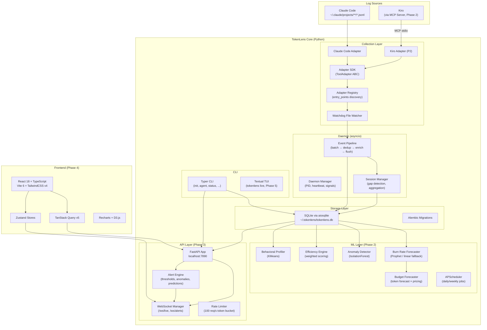
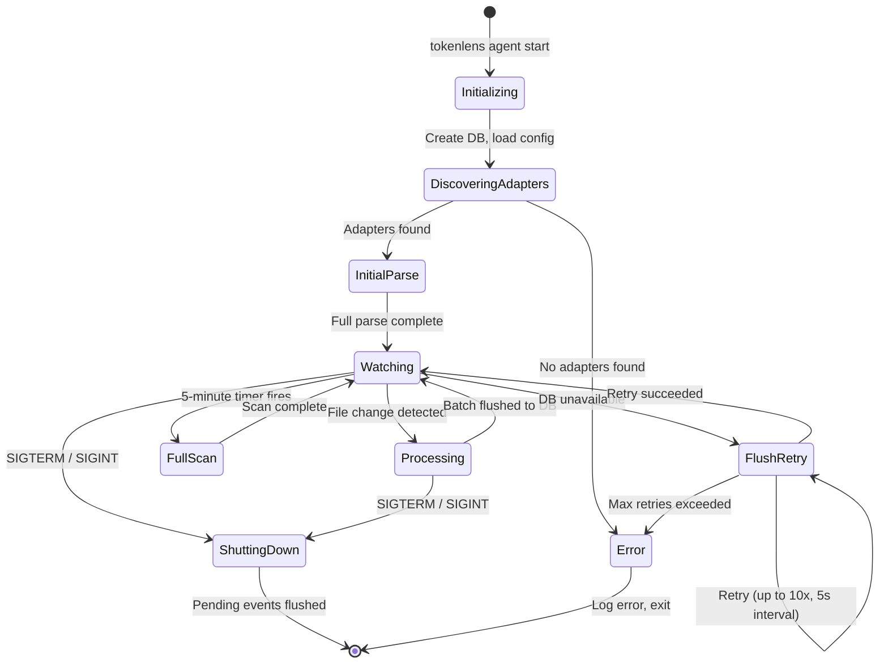
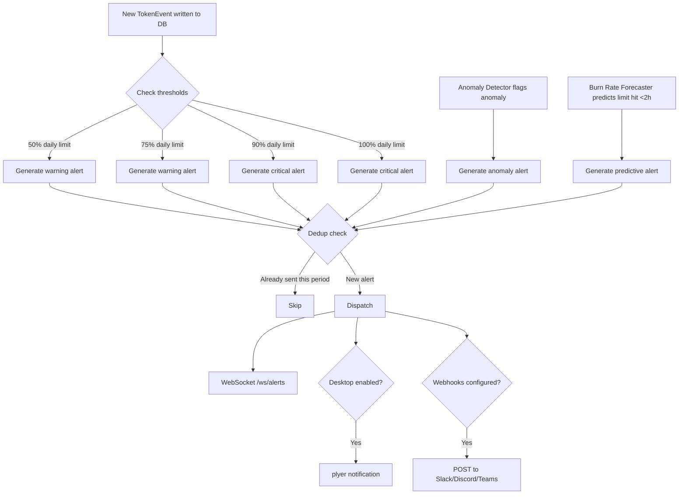
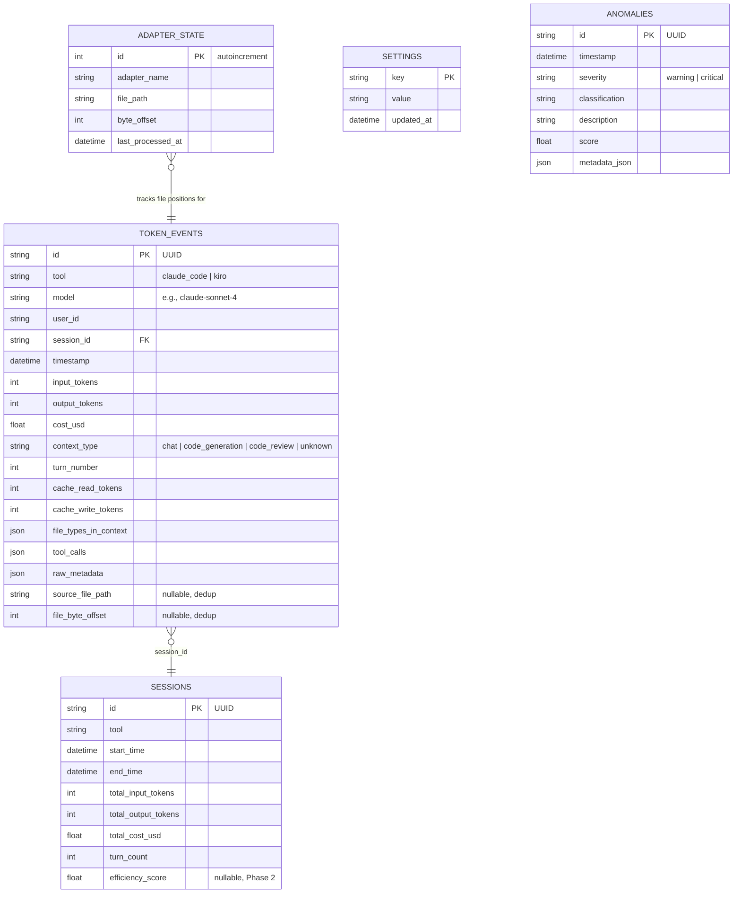

# TokenLens — Design Document

## Overview

TokenLens is a local-first, open-source token monitoring and prediction platform for AI coding tools. It collects token usage data from Claude Code (Phase 1) and Kiro via MCP (Phase 2), stores it in a unified SQLite schema, provides ML-powered predictions, and surfaces insights through a web dashboard, REST API, and CLI.

The system is designed as a single-user, local-first application that runs entirely on the developer's machine. No data leaves the local environment. The architecture prioritizes low latency for real-time monitoring, extensibility via an adapter SDK, and graceful degradation when ML models are unavailable.

### Phased Delivery

| Phase | Scope | Depth in This Design |
|-------|-------|---------------------|
| Phase 1 | Core Data Fabric — schema, adapters, daemon, SQLite, basic CLI, config | **Full depth** — code-ready models, interfaces, state machines |
| Phase 2 | Intelligence Engine — Prophet forecasting, anomaly detection, efficiency scoring, behavioral profiling, budget forecasting, Kiro MCP server | **Medium depth** — ML pipeline architecture, I/O contracts, training flow |
| Phase 3 | FastAPI Backend — REST API, WebSocket, alert engine | **Medium depth** — route structure, request/response models, WebSocket schemas |
| Phase 4 | Web Dashboard — React frontend | **High-level** — component tree, store shapes, data flow |
| Phase 5 | CLI & Integrations — TUI, shell prompt, Kiro steering | **High-level** — command tree, TUI layout, MCP tool definitions |
| Phase 6 | Distribution & Polish — Docker, CI/CD, docs | **Minimal** — Dockerfile structure, workflow triggers, pyproject.toml layout |

### Key Design Decisions

1. **Adapter methods are synchronous** — the daemon wraps them in `asyncio.to_thread()` to avoid blocking the async event loop.
2. **Session aggregation on close** — sessions are aggregated when a gap >15 min is detected or on daemon shutdown, not on every insert.
3. **Deduplication key** — `(tool, source_file_path, file_byte_offset)` as a safety net; adapter_state read position tracking is the primary dedup mechanism.
4. **Cost via fuzzy model matching** — strips version suffixes/date stamps from model names before pricing lookup.
5. **Budget forecasting derives from token forecast** — applies pricing to the burn rate forecaster's token predictions rather than training a separate cost model.
6. **WebSocket pushes every 5s** — frontend interpolates between snapshots using burn rate for perceived real-time responsiveness.
7. **CLI export calls API** — no duplicate export logic; if API is down, CLI starts a temporary in-process server.
8. **Kiro adapter deferred to Phase 2** — uses MCP Server approach since Kiro has no local chat logs.

---

## Architecture

### System Architecture Diagram



### Daemon State Machine



### Directory Layout

```
tokenlens/
├── pyproject.toml                    # uv/pip project config, entry points, extras
├── alembic.ini                       # Alembic configuration
├── docker-compose.yml
├── Dockerfile
├── .pre-commit-config.yaml
├── .github/
│   └── workflows/
│       ├── ci.yml                    # Lint, type-check, test on push/PR
│       └── release.yml               # Build + publish on tag
├── src/
│   └── tokenlens/
│       ├── __init__.py               # Package version
│       ├── core/
│       │   ├── __init__.py
│       │   ├── schema.py             # Pydantic v2 models (TokenEvent, Session, etc.)
│       │   ├── config.py             # dynaconf configuration loader
│       │   ├── database.py           # SQLAlchemy 2.0 async engine + session factory
│       │   ├── models.py             # SQLAlchemy ORM models (tables)
│       │   ├── pricing.py            # Model pricing table + fuzzy matching
│       │   └── migrations/           # Alembic migration scripts
│       │       ├── env.py            # MUST use async pattern: run_async_migrations()
│       │       └── versions/         # Initial migration auto-generated from ORM models
│       ├── adapters/
│       │   ├── __init__.py
│       │   ├── base.py               # ToolAdapter ABC
│       │   ├── registry.py           # AdapterRegistry (entry_points + built-in)
│       │   └── claude_code.py        # Claude Code JSONL adapter
│       ├── agent/
│       │   ├── __init__.py
│       │   ├── daemon.py             # Daemon lifecycle (PID, signals, heartbeat)
│       │   ├── watcher.py            # Watchdog integration + periodic full-scan
│       │   ├── pipeline.py           # Event pipeline (batch, dedup, enrich, flush)
│       │   └── session.py            # Session boundary detection + aggregation
│       ├── ml/
│       │   ├── __init__.py
│       │   ├── base.py               # MLModule ABC (train/predict/evaluate)
│       │   ├── forecaster.py         # Burn rate forecaster (Prophet + linear)
│       │   ├── anomaly.py            # Anomaly detector (IsolationForest)
│       │   ├── efficiency.py         # Context efficiency engine
│       │   ├── profiler.py           # Behavioral profiler (KMeans)
│       │   ├── budget.py             # Budget forecaster (token forecast × pricing)
│       │   └── scheduler.py          # APScheduler job definitions
│       ├── api/
│       │   ├── __init__.py
│       │   ├── app.py                # FastAPI app factory + lifespan
│       │   ├── deps.py               # Dependency injection (DB session, config)
│       │   ├── middleware.py          # CORS, request ID, rate limiter
│       │   ├── websocket.py          # WebSocket manager (/ws/live, /ws/alerts)
│       │   └── routes/
│       │       ├── __init__.py
│       │       ├── status.py          # /api/v1/status
│       │       ├── events.py          # /api/v1/events, /api/v1/events/stream
│       │       ├── sessions.py        # /api/v1/sessions
│       │       ├── analytics.py       # /api/v1/analytics/*
│       │       ├── predictions.py     # /api/v1/predictions/*
│       │       ├── efficiency.py      # /api/v1/efficiency/*
│       │       ├── anomalies.py       # /api/v1/anomalies
│       │       ├── settings.py        # /api/v1/settings
│       │       └── export.py          # /api/v1/export/*
│       ├── alerts/
│       │   ├── __init__.py
│       │   ├── engine.py             # Alert evaluation + dispatch
│       │   ├── desktop.py            # plyer desktop notifications
│       │   └── webhooks.py           # Slack/Discord/Teams webhook POST
│       ├── cli/
│       │   ├── __init__.py
│       │   ├── main.py               # Typer app, top-level commands
│       │   ├── live.py               # Textual TUI (Phase 5)
│       │   └── commands/
│       │       ├── __init__.py
│       │       ├── agent.py           # agent start/stop/status
│       │       ├── init.py            # tokenlens init
│       │       ├── status.py          # tokenlens status
│       │       ├── report.py          # tokenlens report (Phase 5)
│       │       ├── predict.py         # tokenlens predict (Phase 5)
│       │       ├── compare.py         # tokenlens compare (Phase 5)
│       │       ├── export.py          # tokenlens export (Phase 5)
│       │       ├── ml.py              # tokenlens ml retrain (Phase 5)
│       │       ├── serve.py           # tokenlens serve (Phase 5)
│       │       └── data.py            # tokenlens data archive/prune (Phase 6)
│       └── integrations/
│           ├── __init__.py
│           ├── kiro.py               # Kiro steering file generator (Phase 5)
│           └── mcp_server.py         # MCP server for Kiro (Phase 2)
├── ui/                               # React frontend (Phase 4)
│   ├── package.json
│   ├── vite.config.ts
│   ├── tsconfig.json
│   ├── tailwind.config.ts
│   ├── src/
│   │   ├── main.tsx
│   │   ├── App.tsx
│   │   ├── components/
│   │   ├── pages/
│   │   ├── stores/
│   │   ├── hooks/
│   │   ├── lib/
│   │   └── types/
│   └── tests/
├── tests/
│   ├── conftest.py                   # Shared fixtures, async DB setup
│   ├── factories.py                  # factory-boy factories
│   ├── unit/
│   │   ├── test_schema.py
│   │   ├── test_pricing.py
│   │   ├── test_config.py
│   │   ├── test_claude_code_adapter.py
│   │   ├── test_session.py
│   │   ├── test_pipeline.py
│   │   └── ...
│   ├── integration/
│   │   ├── test_api_status.py
│   │   ├── test_api_events.py
│   │   ├── test_websocket.py
│   │   └── ...
│   └── property/                     # Property-based tests (Hypothesis)
│       ├── test_schema_properties.py
│       ├── test_pricing_properties.py
│       └── ...
└── docs/
    ├── mkdocs.yml
    └── docs/
        ├── index.md
        ├── installation.md
        ├── configuration.md
        └── ...
```


---

## Components and Interfaces

### Phase 1: Core Data Fabric (Full Depth)

#### 1.1 Configuration System (`core/config.py`)

TokenLens uses dynaconf with TOML format. The config file lives at `~/.tokenlens/config.toml`.

**Default config.toml structure:**

```toml
[general]
user_id = "default"
data_dir = "~/.tokenlens"

[daemon]
batch_write_interval_seconds = 2   # Flush batch to DB every N seconds
full_scan_interval_minutes = 5     # Fallback full-scan interval
session_gap_minutes = 15           # Inactivity gap to close a session

[adapters.claude_code]
enabled = true
log_path = "~/.claude/projects"
session_gap_minutes = 15

[adapters.kiro]
enabled = false                    # Deferred to Phase 2
log_path = "~/.kiro"
session_gap_minutes = 15
estimation_model = "cl100k_base"

[pricing]
# Model pricing: input and output per 1M tokens
[pricing.models]
"claude-sonnet-4"  = { input = 3.0,  output = 15.0 }
"claude-opus-4"    = { input = 15.0, output = 75.0 }
"claude-haiku-3.5" = { input = 0.80, output = 4.0 }
"kiro-auto"        = { input = 3.0,  output = 15.0 }

[api]
host = "127.0.0.1"
port = 7890
cors_origins = ["http://localhost:5173", "http://localhost:7890"]

[alerts]
enabled = true
desktop_notifications = true

[alerts.thresholds]
daily_token_limit = 500000
monthly_cost_budget = 50.0
warning_percentages = [50, 75, 90, 100]

[alerts.webhooks]
# slack_url = "https://hooks.slack.com/..."
# discord_url = "https://discord.com/api/webhooks/..."

[ml]
enabled = true

[ml.anomaly]
threshold = -0.3
input_heavy_classification = "Large context loading"
extended_conversation_turns = 30
usage_burst_multiplier = 3.0

[integrations.kiro]
enabled = false
steering_update_interval_minutes = 30
```

**Config loader interface:**

```python
# src/tokenlens/core/config.py
from pathlib import Path
from dynaconf import Dynaconf

TOKENLENS_DIR = Path.home() / ".tokenlens"
CONFIG_PATH = TOKENLENS_DIR / "config.toml"

settings = Dynaconf(
    envvar_prefix="TOKENLENS",
    settings_files=[str(CONFIG_PATH)],
    environments=False,
    load_dotenv=False,
)

def get_data_dir() -> Path:
    return Path(settings.get("general.data_dir", str(TOKENLENS_DIR))).expanduser()

def get_db_path() -> Path:
    return get_data_dir() / "tokenlens.db"

def get_pricing_table() -> dict[str, dict[str, float]]:
    return settings.get("pricing.models", {})

def get_session_gap_minutes(tool: str) -> int:
    return settings.get(f"adapters.{tool}.session_gap_minutes", 15)

def ensure_dirs() -> None:
    """Create ~/.tokenlens and subdirectories if they don't exist."""
    data_dir = get_data_dir()
    data_dir.mkdir(parents=True, exist_ok=True)
    (data_dir / "logs").mkdir(exist_ok=True)
    (data_dir / "models").mkdir(exist_ok=True)
```

#### 1.2 Pydantic Schemas (`core/schema.py`)

```python
# src/tokenlens/core/schema.py
from __future__ import annotations

import uuid
from datetime import datetime, timezone
from enum import Enum
from typing import Any

from pydantic import BaseModel, Field, field_validator, model_validator


class ToolEnum(str, Enum):
    CLAUDE_CODE = "claude_code"
    KIRO = "kiro"


class ContextType(str, Enum):
    CHAT = "chat"
    CODE_GENERATION = "code_generation"
    CODE_REVIEW = "code_review"
    UNKNOWN = "unknown"


class TokenEvent(BaseModel):
    """Unified token event schema. Validates all token data regardless of source tool."""

    id: uuid.UUID = Field(default_factory=uuid.uuid4)
    tool: ToolEnum
    model: str
    user_id: str
    session_id: str = Field(default_factory=lambda: str(uuid.uuid4()))
    timestamp: datetime
    input_tokens: int = Field(ge=0)
    output_tokens: int = Field(ge=0)
    cost_usd: float = Field(ge=0.0, default=0.0)
    context_type: ContextType = ContextType.UNKNOWN
    turn_number: int = Field(ge=0, default=0)

    # Optional fields with defaults
    cache_read_tokens: int = Field(ge=0, default=0)
    cache_write_tokens: int = Field(ge=0, default=0)
    file_types_in_context: list[str] = Field(default_factory=list)
    tool_calls: list[str] = Field(default_factory=list)
    raw_metadata: dict[str, Any] = Field(default_factory=dict)

    # Dedup fields (not part of the logical schema, used by pipeline)
    source_file_path: str | None = None
    file_byte_offset: int | None = None

    @field_validator("timestamp", mode="before")
    @classmethod
    def ensure_timezone(cls, v: Any) -> datetime:
        if isinstance(v, datetime) and v.tzinfo is None:
            return v.replace(tzinfo=timezone.utc)
        return v

    model_config = {"from_attributes": True}


class Session(BaseModel):
    """Aggregated session model. Computed on session close."""

    id: uuid.UUID = Field(default_factory=uuid.uuid4)
    tool: ToolEnum
    start_time: datetime
    end_time: datetime
    total_input_tokens: int = Field(ge=0, default=0)
    total_output_tokens: int = Field(ge=0, default=0)
    total_cost_usd: float = Field(ge=0.0, default=0.0)
    turn_count: int = Field(ge=0, default=0)
    efficiency_score: float | None = None  # Populated in Phase 2

    model_config = {"from_attributes": True}


class AdapterState(BaseModel):
    """Tracks per-file read position for incremental parsing."""

    adapter_name: str
    file_path: str
    byte_offset: int = 0
    last_processed_at: datetime = Field(
        default_factory=lambda: datetime.now(timezone.utc)
    )

    model_config = {"from_attributes": True}
```

#### 1.3 SQLAlchemy ORM Models (`core/models.py`)

```python
# src/tokenlens/core/models.py
from __future__ import annotations

import uuid
from datetime import datetime, timezone

from sqlalchemy import (
    JSON,
    DateTime,
    Enum,
    Float,
    Index,
    Integer,
    String,
    Text,
    UniqueConstraint,
)
from sqlalchemy.orm import DeclarativeBase, Mapped, mapped_column


class Base(DeclarativeBase):
    pass


# Define shared enum types once — reused across tables.
# SQLite stores as strings; PostgreSQL creates a single enum type.
_tool_enum = Enum("claude_code", "kiro", name="tool_enum")


class TokenEventRow(Base):
    __tablename__ = "token_events"

    id: Mapped[str] = mapped_column(
        String(36), primary_key=True, default=lambda: str(uuid.uuid4())
    )
    tool: Mapped[str] = mapped_column(_tool_enum, nullable=False)
    model: Mapped[str] = mapped_column(String(128), nullable=False)
    user_id: Mapped[str] = mapped_column(String(128), nullable=False)
    session_id: Mapped[str] = mapped_column(String(36), nullable=False)
    timestamp: Mapped[datetime] = mapped_column(DateTime(timezone=True), nullable=False)
    input_tokens: Mapped[int] = mapped_column(Integer, nullable=False)
    output_tokens: Mapped[int] = mapped_column(Integer, nullable=False)
    cost_usd: Mapped[float] = mapped_column(Float, nullable=False, default=0.0)
    context_type: Mapped[str] = mapped_column(
        Enum("chat", "code_generation", "code_review", "unknown", name="context_type_enum"),
        nullable=False,
        default="unknown",
    )
    turn_number: Mapped[int] = mapped_column(Integer, nullable=False, default=0)

    # Optional fields
    cache_read_tokens: Mapped[int] = mapped_column(Integer, nullable=False, default=0)
    cache_write_tokens: Mapped[int] = mapped_column(Integer, nullable=False, default=0)
    file_types_in_context: Mapped[dict] = mapped_column(JSON, nullable=False, default=list)
    tool_calls: Mapped[dict] = mapped_column(JSON, nullable=False, default=list)
    raw_metadata: Mapped[dict] = mapped_column(JSON, nullable=False, default=dict)

    # Dedup fields
    source_file_path: Mapped[str | None] = mapped_column(Text, nullable=True)
    file_byte_offset: Mapped[int | None] = mapped_column(Integer, nullable=True)

    __table_args__ = (
        Index("ix_token_events_timestamp", "timestamp"),
        Index("ix_token_events_tool", "tool"),
        Index("ix_token_events_model", "model"),
        Index("ix_token_events_user_id", "user_id"),
        Index("ix_token_events_session_id", "session_id"),
        Index("ix_token_events_tool_timestamp", "tool", "timestamp"),  # Composite: most common query pattern
        UniqueConstraint(
            "tool", "source_file_path", "file_byte_offset",
            name="uq_dedup_key",
        ),
    )


class SessionRow(Base):
    __tablename__ = "sessions"

    id: Mapped[str] = mapped_column(
        String(36), primary_key=True, default=lambda: str(uuid.uuid4())
    )
    tool: Mapped[str] = mapped_column(_tool_enum, nullable=False)
    start_time: Mapped[datetime] = mapped_column(DateTime(timezone=True), nullable=False)
    end_time: Mapped[datetime] = mapped_column(DateTime(timezone=True), nullable=False)
    total_input_tokens: Mapped[int] = mapped_column(Integer, nullable=False, default=0)
    total_output_tokens: Mapped[int] = mapped_column(Integer, nullable=False, default=0)
    total_cost_usd: Mapped[float] = mapped_column(Float, nullable=False, default=0.0)
    turn_count: Mapped[int] = mapped_column(Integer, nullable=False, default=0)
    efficiency_score: Mapped[float | None] = mapped_column(Float, nullable=True)

    __table_args__ = (
        Index("ix_sessions_tool", "tool"),
        Index("ix_sessions_start_time", "start_time"),
    )


class AdapterStateRow(Base):
    __tablename__ = "adapter_state"

    id: Mapped[int] = mapped_column(Integer, primary_key=True, autoincrement=True)
    adapter_name: Mapped[str] = mapped_column(String(64), nullable=False)
    file_path: Mapped[str] = mapped_column(Text, nullable=False)
    byte_offset: Mapped[int] = mapped_column(Integer, nullable=False, default=0)
    last_processed_at: Mapped[datetime] = mapped_column(
        DateTime(timezone=True),
        nullable=False,
        default=lambda: datetime.now(timezone.utc),
    )

    __table_args__ = (
        UniqueConstraint("adapter_name", "file_path", name="uq_adapter_file"),
    )


class SettingRow(Base):
    __tablename__ = "settings"

    key: Mapped[str] = mapped_column(String(256), primary_key=True)
    value: Mapped[str] = mapped_column(Text, nullable=False)
    updated_at: Mapped[datetime] = mapped_column(
        DateTime(timezone=True),
        nullable=False,
        default=lambda: datetime.now(timezone.utc),
    )


class AnomalyRow(Base):
    """Phase 2 table — stores detected anomalies.

    NOT created by Base.metadata.create_all() in Phase 1.
    Added via Alembic migration: 'alembic revision --autogenerate -m "add_anomalies_table"'
    when Phase 2 ML layer is implemented.
    """
    __tablename__ = "anomalies"

    id: Mapped[str] = mapped_column(
        String(36), primary_key=True, default=lambda: str(uuid.uuid4())
    )
    timestamp: Mapped[datetime] = mapped_column(DateTime(timezone=True), nullable=False)
    severity: Mapped[str] = mapped_column(
        Enum("warning", "critical", name="severity_enum"), nullable=False
    )
    classification: Mapped[str] = mapped_column(String(128), nullable=False)
    description: Mapped[str] = mapped_column(Text, nullable=False)
    score: Mapped[float] = mapped_column(Float, nullable=False)
    metadata_json: Mapped[dict] = mapped_column(JSON, nullable=False, default=dict)

    __table_args__ = (
        Index("ix_anomalies_timestamp", "timestamp"),
        Index("ix_anomalies_severity", "severity"),
    )
```

#### 1.4 Database Layer (`core/database.py`)

```python
# src/tokenlens/core/database.py
from __future__ import annotations

from contextlib import asynccontextmanager
from typing import AsyncGenerator

from sqlalchemy.ext.asyncio import (
    AsyncEngine,
    AsyncSession,
    async_sessionmaker,
    create_async_engine,
)

from tokenlens.core.config import get_db_path
from tokenlens.core.models import Base

_engine: AsyncEngine | None = None
_session_factory: async_sessionmaker[AsyncSession] | None = None


async def init_engine(db_url: str | None = None) -> AsyncEngine:
    """Initialize the async SQLAlchemy engine. Idempotent."""
    global _engine, _session_factory
    if _engine is not None:
        return _engine

    if db_url is None:
        db_path = get_db_path()
        db_url = f"sqlite+aiosqlite:///{db_path}"

    _engine = create_async_engine(
        db_url,
        echo=False,
        pool_pre_ping=True,
        connect_args={"check_same_thread": False},  # SQLite-specific
    )
    _session_factory = async_sessionmaker(_engine, expire_on_commit=False)

    # Create tables if they don't exist (Alembic handles migrations in production)
    async with _engine.begin() as conn:
        await conn.run_sync(Base.metadata.create_all)

    return _engine


async def get_engine() -> AsyncEngine:
    if _engine is None:
        await init_engine()
    return _engine  # type: ignore[return-value]


@asynccontextmanager
async def get_session() -> AsyncGenerator[AsyncSession, None]:
    if _session_factory is None:
        await init_engine()
    assert _session_factory is not None
    async with _session_factory() as session:
        try:
            yield session
            await session.commit()
        except Exception:
            await session.rollback()
            raise


async def close_engine() -> None:
    global _engine, _session_factory
    if _engine is not None:
        await _engine.dispose()
        _engine = None
        _session_factory = None
```

**Alembic async configuration note:** Since TokenLens uses async SQLAlchemy with aiosqlite, the Alembic `env.py` must use the async migration pattern. The initial migration should be auto-generated: `alembic revision --autogenerate -m "initial"`. The `env.py` must use `connectable = create_async_engine(...)` with `run_async(engine.begin())` pattern — this is a known gotcha with async SQLAlchemy + Alembic. The AnomalyRow table (Phase 2) should be added via a separate migration: `alembic revision --autogenerate -m "add_anomalies_table"`.


#### 1.5 Model Pricing (`core/pricing.py`)

```python
# src/tokenlens/core/pricing.py
from __future__ import annotations

import re
from tokenlens.core.config import get_pricing_table

# Regex to strip version suffixes and date stamps from model names
# e.g., "claude-sonnet-4-20250514" → "claude-sonnet-4"
_VERSION_SUFFIX_RE = re.compile(r"[-_](\d{8}|\d+\.\d+.*|v\d+.*)$")


def normalize_model_name(raw_name: str) -> str:
    """Strip version suffixes and date stamps for fuzzy matching.

    Examples:
        "claude-sonnet-4-20250514" → "claude-sonnet-4"
        "claude-opus-4-v2" → "claude-opus-4"
        "claude-haiku-3.5" → "claude-haiku-3.5" (no change — it's a known key)
    """
    name = raw_name.strip().lower()
    # Iteratively strip trailing version/date suffixes
    while _VERSION_SUFFIX_RE.search(name):
        name = _VERSION_SUFFIX_RE.sub("", name)
    return name


def calculate_cost(
    model: str,
    input_tokens: int,
    output_tokens: int,
) -> tuple[float, bool]:
    """Calculate cost in USD. Returns (cost, matched).

    If the model is not found after fuzzy matching, returns (0.0, False).
    """
    pricing = get_pricing_table()
    normalized = normalize_model_name(model)

    # Exact match first
    if normalized in pricing:
        entry = pricing[normalized]
        cost = (input_tokens * entry["input"] / 1_000_000) + (
            output_tokens * entry["output"] / 1_000_000
        )
        return (cost, True)

    # Try matching against normalized keys
    for key in pricing:
        if normalize_model_name(key) == normalized:
            entry = pricing[key]
            cost = (input_tokens * entry["input"] / 1_000_000) + (
                output_tokens * entry["output"] / 1_000_000
            )
            return (cost, True)

    return (0.0, False)
```

#### 1.6 Adapter SDK (`adapters/base.py`)

```python
# src/tokenlens/adapters/base.py
from __future__ import annotations

from abc import ABC, abstractmethod
from pathlib import Path

from tokenlens.core.schema import TokenEvent


class ToolAdapter(ABC):
    """Abstract base class for all tool adapters.

    Adapter methods are SYNCHRONOUS. The daemon wraps calls in
    asyncio.to_thread() to avoid blocking the event loop.

    File watching is handled by the daemon's watchdog, not by adapters.
    """

    @property
    @abstractmethod
    def name(self) -> str:
        """Unique adapter name (e.g., 'claude_code', 'kiro')."""
        ...

    @property
    @abstractmethod
    def version(self) -> str:
        """Semantic version string of this adapter."""
        ...

    @abstractmethod
    def discover(self) -> bool:
        """Return True if this tool's log files exist on the local machine."""
        ...

    @abstractmethod
    def get_log_paths(self) -> list[Path]:
        """Return all log file paths this adapter can parse."""
        ...

    @abstractmethod
    def parse_file(self, path: Path) -> list[TokenEvent]:
        """Parse a log file and return TokenEvents.

        Raises:
            FileNotFoundError: If path does not exist.
        """
        ...

    @abstractmethod
    def get_last_processed_position(self, path: Path) -> int:
        """Return the byte offset of the last processed position for a file."""
        ...

    # NOTE: watch() is NOT part of the adapter interface.
    # File watching is a daemon concern (via watchdog), not an adapter concern.
    # The adapter's job is: discover(), get_log_paths(), parse_file().
```

#### 1.7 Adapter Registry (`adapters/registry.py`)

```python
# src/tokenlens/adapters/registry.py
from __future__ import annotations

import importlib.metadata
import logging
from typing import TYPE_CHECKING

if TYPE_CHECKING:
    from tokenlens.adapters.base import ToolAdapter

logger = logging.getLogger(__name__)

ENTRY_POINT_GROUP = "tokenlens.adapters"


class AdapterRegistry:
    """Discovers and manages tool adapters.

    Built-in adapters are registered explicitly.
    Community adapters are discovered via Python entry_points.
    """

    def __init__(self) -> None:
        self._adapters: dict[str, ToolAdapter] = {}

    def register(self, adapter: ToolAdapter) -> None:
        """Register an adapter. First registration wins on name collision."""
        if adapter.name in self._adapters:
            logger.warning(
                "Adapter '%s' already registered — keeping first. "
                "Ignoring duplicate from %s.",
                adapter.name,
                type(adapter).__name__,
            )
            return
        self._adapters[adapter.name] = adapter
        logger.info("Registered adapter: %s (v%s)", adapter.name, adapter.version)

    def discover_entry_points(self) -> None:
        """Load adapters from Python entry_points under 'tokenlens.adapters'."""
        eps = importlib.metadata.entry_points()
        group = eps.select(group=ENTRY_POINT_GROUP) if hasattr(eps, "select") else eps.get(ENTRY_POINT_GROUP, [])
        for ep in group:
            try:
                adapter_cls = ep.load()
                adapter = adapter_cls()
                self.register(adapter)
            except Exception:
                logger.warning(
                    "Failed to load adapter entry_point '%s'. Skipping.",
                    ep.name,
                    exc_info=True,
                )

    def load_builtins(self) -> None:
        """Register built-in adapters (Claude Code, Kiro stub)."""
        from tokenlens.adapters.claude_code import ClaudeCodeAdapter

        self.register(ClaudeCodeAdapter())
        # Kiro adapter registered in Phase 2

    def get_all(self) -> list[ToolAdapter]:
        """Return all registered adapters."""
        return list(self._adapters.values())

    def get_available(self) -> list[ToolAdapter]:
        """Return only adapters whose discover() returns True."""
        available = []
        for adapter in self._adapters.values():
            try:
                if adapter.discover():
                    available.append(adapter)
            except Exception:
                logger.warning(
                    "Adapter '%s' discover() raised an exception. Skipping.",
                    adapter.name,
                    exc_info=True,
                )
        return available

    def get(self, name: str) -> ToolAdapter | None:
        return self._adapters.get(name)
```

#### 1.8 Claude Code Adapter (`adapters/claude_code.py`)

```python
# src/tokenlens/adapters/claude_code.py
from __future__ import annotations

import json
import logging
from datetime import datetime, timezone
from pathlib import Path
from typing import Any, Callable

from tokenlens.adapters.base import ToolAdapter
from tokenlens.core.pricing import calculate_cost
from tokenlens.core.schema import ContextType, TokenEvent, ToolEnum

logger = logging.getLogger(__name__)

DEFAULT_LOG_DIR = Path.home() / ".claude" / "projects"


class ClaudeCodeAdapter(ToolAdapter):
    """Parses Claude Code JSONL conversation logs.

    Each line in a .jsonl file is a JSON object representing a conversation turn.
    The adapter tracks byte offsets per file to support incremental parsing.
    """

    def __init__(self, log_dir: Path | None = None) -> None:
        self._log_dir = log_dir or DEFAULT_LOG_DIR
        self._file_positions: dict[str, int] = {}  # path → byte offset
        self._turn_counters: dict[str, int] = {}   # session_id → turn count

    @property
    def name(self) -> str:
        return "claude_code"

    @property
    def version(self) -> str:
        return "1.0.0"

    def discover(self) -> bool:
        return self._log_dir.exists() and any(self._log_dir.rglob("*.jsonl"))

    def get_log_paths(self) -> list[Path]:
        if not self._log_dir.exists():
            return []
        return sorted(self._log_dir.rglob("*.jsonl"))

    def parse_file(self, path: Path) -> list[TokenEvent]:
        """Parse a JSONL file from the stored byte offset.

        Returns new TokenEvents since last parse. Updates internal position.
        """
        if not path.exists():
            raise FileNotFoundError(f"Log file not found: {path}")

        events: list[TokenEvent] = []
        str_path = str(path)
        offset = self._file_positions.get(str_path, 0)

        with open(path, "r", encoding="utf-8") as f:
            f.seek(offset)
            line_number = 0
            for line in f:
                line_number += 1
                # Each event's byte_offset is the file position at the START
                # of its JSONL line. This is the dedup key — each line has a
                # unique start offset regardless of content.
                line_start_offset = f.tell() - len(line.encode("utf-8"))
                line = line.strip()
                if not line:
                    continue
                try:
                    data = json.loads(line)
                    event = self._parse_entry(data, path, line_start_offset)
                    if event is not None:
                        events.append(event)
                except json.JSONDecodeError:
                    # Malformed line — offset still advances past it.
                    # This is intentional: we don't want to re-parse bad lines.
                    logger.warning(
                        "Malformed JSON at %s line %d (offset %d). Skipping.",
                        path.name,
                        line_number,
                        line_start_offset,
                    )
                except Exception:
                    logger.warning(
                        "Error parsing entry at %s line %d. Skipping.",
                        path.name,
                        line_number,
                        exc_info=True,
                    )

            self._file_positions[str_path] = f.tell()

        return events

    def _parse_entry(
        self, data: dict[str, Any], path: Path, byte_offset: int
    ) -> TokenEvent | None:
        """Convert a single JSONL entry to a TokenEvent, or None if not applicable."""
        # Only process assistant turns with token usage
        role = data.get("role", "")
        if role != "assistant":
            return None

        model = data.get("model", "unknown")
        input_tokens = data.get("input_tokens", 0)
        output_tokens = data.get("output_tokens", 0)

        if input_tokens == 0 and output_tokens == 0:
            return None

        cache_read = data.get("cache_read_input_tokens", 0)
        cache_write = data.get("cache_creation_input_tokens", 0)

        timestamp_raw = data.get("timestamp")
        if timestamp_raw:
            timestamp = datetime.fromisoformat(str(timestamp_raw))
            if timestamp.tzinfo is None:
                timestamp = timestamp.replace(tzinfo=timezone.utc)
        else:
            timestamp = datetime.now(timezone.utc)

        cost, _matched = calculate_cost(model, input_tokens, output_tokens)

        # Track turn numbers per session (assigned by SessionManager later,
        # but we count per-file for ordering within a parse batch)
        turn_key = str(path)
        self._turn_counters[turn_key] = self._turn_counters.get(turn_key, 0) + 1

        return TokenEvent(
            tool=ToolEnum.CLAUDE_CODE,
            model=model,
            user_id="default",  # Single-user, overridden by config
            timestamp=timestamp,
            input_tokens=input_tokens,
            output_tokens=output_tokens,
            cache_read_tokens=cache_read,
            cache_write_tokens=cache_write,
            cost_usd=cost,
            turn_number=self._turn_counters[turn_key],
            source_file_path=str(path),
            file_byte_offset=byte_offset,
            raw_metadata={"role": role},
        )

    def set_position(self, path: Path, offset: int) -> None:
        """Restore position from adapter_state DB table on daemon startup."""
        self._file_positions[str(path)] = offset
```

#### 1.9 Daemon Manager (`agent/daemon.py`)

```python
# src/tokenlens/agent/daemon.py — Interface and lifecycle
from __future__ import annotations

import asyncio
import os
import signal
import sys
from datetime import datetime, timezone
from pathlib import Path

import structlog

from tokenlens.core.config import get_data_dir

logger = structlog.get_logger()

PID_FILE = "agent.pid"
HEALTH_FILE = "agent.health"
LOG_FILE = "logs/agent.log"


class DaemonManager:
    """Manages daemon lifecycle: PID file, heartbeat, signal handling, shutdown."""

    def __init__(self) -> None:
        self._data_dir = get_data_dir()
        self._pid_path = self._data_dir / PID_FILE
        self._health_path = self._data_dir / HEALTH_FILE
        self._shutdown_event = asyncio.Event()
        self._events_processed: int = 0

    @property
    def pid_path(self) -> Path:
        return self._pid_path

    def is_running(self) -> tuple[bool, int | None]:
        """Check if daemon is already running. Returns (running, pid)."""
        if not self._pid_path.exists():
            return (False, None)

        try:
            pid = int(self._pid_path.read_text().strip())
        except (ValueError, OSError):
            return (False, None)

        # Check if process is alive
        try:
            os.kill(pid, 0)  # Signal 0 = check existence
            return (True, pid)
        except ProcessLookupError:
            # Stale PID file — process is dead
            logger.warning("Stale PID file found (PID %d). Removing.", pid)
            self._pid_path.unlink(missing_ok=True)
            return (False, None)
        except PermissionError:
            # Process exists but we can't signal it
            return (True, pid)

    def write_pid(self) -> None:
        self._pid_path.write_text(str(os.getpid()))
        self._pid_path.chmod(0o600)

    def remove_pid(self) -> None:
        self._pid_path.unlink(missing_ok=True)

    def write_heartbeat(self) -> None:
        self._health_path.write_text(datetime.now(timezone.utc).isoformat())

    def read_heartbeat(self) -> datetime | None:
        if not self._health_path.exists():
            return None
        try:
            return datetime.fromisoformat(self._health_path.read_text().strip())
        except (ValueError, OSError):
            return None

    def setup_signal_handlers(self, loop: asyncio.AbstractEventLoop) -> None:
        """Register SIGTERM and SIGINT handlers for graceful shutdown."""
        for sig in (signal.SIGTERM, signal.SIGINT):
            loop.add_signal_handler(sig, self._handle_signal, sig)

    def _handle_signal(self, sig: signal.Signals) -> None:
        logger.info("Received signal %s. Initiating graceful shutdown.", sig.name)
        self._shutdown_event.set()

    @property
    def shutdown_requested(self) -> bool:
        return self._shutdown_event.is_set()

    async def wait_for_shutdown(self) -> None:
        await self._shutdown_event.wait()

    def increment_events(self, count: int = 1) -> None:
        self._events_processed += count

    @property
    def events_processed(self) -> int:
        return self._events_processed
```

#### 1.10 Event Pipeline (`agent/pipeline.py`)

```python
# src/tokenlens/agent/pipeline.py — Batch, dedup, enrich, flush
from __future__ import annotations

import asyncio
import logging
from datetime import datetime, timezone

from sqlalchemy import select
from sqlalchemy.dialects.sqlite import insert as sqlite_insert

from tokenlens.core.database import get_session
from tokenlens.core.models import AdapterStateRow, TokenEventRow
from tokenlens.core.pricing import calculate_cost
from tokenlens.core.schema import TokenEvent

logger = logging.getLogger(__name__)

MAX_FLUSH_RETRIES = 10
RETRY_DELAY_SECONDS = 5


class EventPipeline:
    """Batches, deduplicates, enriches, and flushes TokenEvents to the database.

    Events are accumulated in memory and flushed every `flush_interval` seconds.
    On DB failure, retries up to MAX_FLUSH_RETRIES times with RETRY_DELAY_SECONDS.
    """

    def __init__(self, flush_interval: float = 2.0) -> None:
        self._buffer: list[TokenEvent] = []
        self._lock = asyncio.Lock()
        self._flush_interval = flush_interval
        self._total_flushed: int = 0

    async def add_events(self, events: list[TokenEvent]) -> None:
        async with self._lock:
            for event in events:
                # Enrich: recalculate cost if not set
                if event.cost_usd == 0.0:
                    cost, matched = calculate_cost(
                        event.model, event.input_tokens, event.output_tokens
                    )
                    if not matched:
                        logger.warning(
                            "Unrecognized model '%s'. Cost set to $0.00.",
                            event.model,
                        )
                    event.cost_usd = cost
                self._buffer.append(event)

    async def flush(self) -> int:
        """Flush buffered events to DB. Returns count of events written."""
        async with self._lock:
            if not self._buffer:
                return 0
            batch = self._buffer.copy()
            self._buffer.clear()

        retries = 0
        while retries <= MAX_FLUSH_RETRIES:
            try:
                written = await self._write_batch(batch)
                self._total_flushed += written
                return written
            except Exception:
                retries += 1
                if retries > MAX_FLUSH_RETRIES:
                    logger.error(
                        "Failed to flush %d events after %d retries. Events lost.",
                        len(batch),
                        MAX_FLUSH_RETRIES,
                    )
                    raise
                logger.warning(
                    "DB flush failed (attempt %d/%d). Retrying in %ds.",
                    retries,
                    MAX_FLUSH_RETRIES,
                    RETRY_DELAY_SECONDS,
                )
                # NOTE: Do NOT put events back in _buffer during retry.
                # The batch stays local. New events accumulate in _buffer
                # independently and get flushed on the next regular cycle.
                await asyncio.sleep(RETRY_DELAY_SECONDS)

        return 0  # unreachable but satisfies type checker

    async def _write_batch(self, batch: list[TokenEvent]) -> int:
        """Write a batch of events using INSERT OR IGNORE for dedup."""
        written = 0
        async with get_session() as session:
            for event in batch:
                stmt = sqlite_insert(TokenEventRow).values(
                    id=str(event.id),
                    tool=event.tool.value,
                    model=event.model,
                    user_id=event.user_id,
                    session_id=event.session_id,
                    timestamp=event.timestamp,
                    input_tokens=event.input_tokens,
                    output_tokens=event.output_tokens,
                    cost_usd=event.cost_usd,
                    context_type=event.context_type.value,
                    turn_number=event.turn_number,
                    cache_read_tokens=event.cache_read_tokens,
                    cache_write_tokens=event.cache_write_tokens,
                    file_types_in_context=event.file_types_in_context,
                    tool_calls=event.tool_calls,
                    raw_metadata=event.raw_metadata,
                    source_file_path=event.source_file_path,
                    file_byte_offset=event.file_byte_offset,
                ).on_conflict_do_nothing(
                    index_elements=["tool", "source_file_path", "file_byte_offset"]
                )
                result = await session.execute(stmt)
                if result.rowcount > 0:
                    written += 1
        return written

    @property
    def pending_count(self) -> int:
        return len(self._buffer)

    @property
    def total_flushed(self) -> int:
        return self._total_flushed
```

#### 1.11 Session Manager (`agent/session.py`)

```python
# src/tokenlens/agent/session.py
from __future__ import annotations

import uuid
from datetime import datetime, timedelta, timezone

import structlog
from sqlalchemy import func, select

from tokenlens.core.database import get_session
from tokenlens.core.models import SessionRow, TokenEventRow
from tokenlens.core.schema import TokenEvent

logger = structlog.get_logger()


class SessionManager:
    """Detects session boundaries and aggregates session stats on close.

    A session closes when:
    1. A gap >session_gap_minutes is detected between consecutive events.
    2. The daemon shuts down (flush_all_open_sessions).
    """

    def __init__(self, session_gap_minutes: int = 15) -> None:
        self._gap = timedelta(minutes=session_gap_minutes)
        self._open_sessions: dict[str, tuple[str, datetime]] = {}
        self._pending_closes: list[tuple[str, str]] = []

    def assign_session_id(self, event: TokenEvent) -> str:
        """Assign a session_id to an event. Detects boundaries by gap.

        Returns the session_id (may be new or existing).
        """
        tool_key = event.tool.value
        now = event.timestamp

        if tool_key in self._open_sessions:
            session_id, last_ts = self._open_sessions[tool_key]
            if (now - last_ts) > self._gap:
                # Gap detected — close old session, start new one
                logger.info(
                    "Session gap detected for %s. Closing session %s.",
                    tool_key,
                    session_id[:8],
                )
                # Schedule aggregation for the closed session
                self._schedule_close(session_id, tool_key)
                # Start new session
                new_id = str(uuid.uuid4())
                self._open_sessions[tool_key] = (new_id, now)
                return new_id
            else:
                # Same session — update timestamp
                self._open_sessions[tool_key] = (session_id, now)
                return session_id
        else:
            # First event for this tool — start new session
            new_id = str(uuid.uuid4())
            self._open_sessions[tool_key] = (new_id, now)
            return new_id

    def _schedule_close(self, session_id: str, tool: str) -> None:
        """Mark a session for aggregation. Actual DB write is async."""
        # Aggregation is performed by close_session() called from the daemon loop
        self._pending_closes.append((session_id, tool))

    async def close_pending_sessions(self) -> None:
        """Aggregate and persist all pending session closes."""
        while self._pending_closes:
            session_id, tool = self._pending_closes.pop(0)
            await self._aggregate_and_persist(session_id, tool)

    async def flush_all_open_sessions(self) -> None:
        """Close all open sessions (called on daemon shutdown)."""
        for tool_key, (session_id, _) in list(self._open_sessions.items()):
            await self._aggregate_and_persist(session_id, tool_key)
        self._open_sessions.clear()

    async def _aggregate_and_persist(self, session_id: str, tool: str) -> None:
        """Compute session aggregates from token_events and write to sessions table."""
        async with get_session() as db:
            result = await db.execute(
                select(
                    func.min(TokenEventRow.timestamp).label("start_time"),
                    func.max(TokenEventRow.timestamp).label("end_time"),
                    func.sum(TokenEventRow.input_tokens).label("total_input"),
                    func.sum(TokenEventRow.output_tokens).label("total_output"),
                    func.sum(TokenEventRow.cost_usd).label("total_cost"),
                    func.count(TokenEventRow.id).label("turn_count"),
                ).where(TokenEventRow.session_id == session_id)
            )
            row = result.one_or_none()
            if row is None or row.start_time is None:
                return

            session_row = SessionRow(
                id=session_id,
                tool=tool,
                start_time=row.start_time,
                end_time=row.end_time,
                total_input_tokens=row.total_input or 0,
                total_output_tokens=row.total_output or 0,
                total_cost_usd=row.total_cost or 0.0,
                turn_count=row.turn_count or 0,
            )
            db.add(session_row)
            logger.info(
                "Session %s closed: %d turns, %d tokens, $%.4f",
                session_id[:8],
                session_row.turn_count,
                session_row.total_input_tokens + session_row.total_output_tokens,
                session_row.total_cost_usd,
            )
```

#### 1.12 File Watcher (`agent/watcher.py`)

```python
# src/tokenlens/agent/watcher.py — Interface sketch
from __future__ import annotations

import asyncio
from pathlib import Path
from typing import Callable

from watchdog.events import FileModifiedEvent, FileSystemEventHandler
from watchdog.observers import Observer

import structlog

logger = structlog.get_logger()


class LogFileHandler(FileSystemEventHandler):
    """Watchdog handler that triggers adapter parsing on file changes."""

    def __init__(self, callback: Callable[[Path], None]) -> None:
        self._callback = callback

    def on_modified(self, event: FileModifiedEvent) -> None:  # type: ignore[override]
        if event.is_directory:
            return
        path = Path(event.src_path)
        if path.suffix == ".jsonl":
            self._callback(path)


class FileWatcher:
    """Manages watchdog observers for all adapter log directories.

    Uses native OS file watching (inotify on Linux, FSEvents on macOS).
    Falls back to periodic full-scan every `full_scan_interval` minutes.
    """

    def __init__(
        self,
        on_file_changed: Callable[[Path], None],
        full_scan_interval_minutes: int = 5,
    ) -> None:
        self._on_file_changed = on_file_changed
        self._full_scan_interval = full_scan_interval_minutes * 60
        self._observer = Observer()
        self._watched_dirs: set[str] = set()

    def watch_directory(self, directory: Path) -> None:
        """Add a directory to the watchdog observer."""
        str_dir = str(directory)
        if str_dir in self._watched_dirs:
            return
        handler = LogFileHandler(self._on_file_changed)
        self._observer.schedule(handler, str_dir, recursive=True)
        self._watched_dirs.add(str_dir)
        logger.info("Watching directory: %s", directory)

    def start(self) -> None:
        self._observer.start()

    def stop(self) -> None:
        self._observer.stop()
        self._observer.join(timeout=5)

    async def periodic_full_scan(
        self,
        scan_callback: Callable[[], None],
        shutdown_event: asyncio.Event,
    ) -> None:
        """Run a full scan every N minutes as a fallback."""
        while not shutdown_event.is_set():
            try:
                await asyncio.wait_for(
                    shutdown_event.wait(),
                    timeout=self._full_scan_interval,
                )
            except asyncio.TimeoutError:
                logger.debug("Running periodic full scan.")
                await asyncio.to_thread(scan_callback)
```

#### 1.13 CLI Commands (`cli/main.py` and `cli/commands/`)

```python
# src/tokenlens/cli/main.py
import typer

app = typer.Typer(
    name="tokenlens",
    help="Token monitoring and prediction platform for AI coding tools.",
    no_args_is_help=True,
)

# Sub-command groups
agent_app = typer.Typer(help="Manage the background collection daemon.")
app.add_typer(agent_app, name="agent")

# Phase 5 additions
# ml_app = typer.Typer(help="ML model management.")
# app.add_typer(ml_app, name="ml")
# data_app = typer.Typer(help="Data management.")
# app.add_typer(data_app, name="data")
```

**CLI command flow (Phase 1):**

```
tokenlens
├── init                    # Create ~/.tokenlens, config.toml, discover adapters
├── agent
│   ├── start [--foreground]  # Start daemon (daemonize or foreground)
│   ├── stop                  # Stop daemon via PID file
│   └── status                # Show daemon state, heartbeat, events count
├── status                  # One-line usage summary
└── (Phase 5+)
    ├── live                # Textual TUI dashboard
    ├── report              # Formatted usage report
    ├── predict             # Burn rate forecast
    ├── compare             # Tool comparison table
    ├── why                 # Explain last anomaly
    ├── optimize            # Efficiency recommendations
    ├── export              # Export events to file
    ├── serve               # Start FastAPI server
    ├── ml retrain          # Retrain ML models
    ├── mcp-serve           # Start MCP server (Phase 2)
    ├── shell-hook          # Shell prompt integration
    └── data
        ├── archive         # Archive old events
        └── prune           # Delete old events
```


---

### Phase 2: Intelligence Engine (Medium Depth)

#### 2.1 ML Module Base Interface

All ML modules share a consistent interface for training, prediction, and evaluation.

```python
# src/tokenlens/ml/base.py
from __future__ import annotations

from abc import ABC, abstractmethod
from pathlib import Path
from typing import Any

import pandas as pd


class MLModule(ABC):
    """Base class for all ML modules."""

    @abstractmethod
    def train(self, data: pd.DataFrame) -> Any:
        """Train the model on historical data. Returns the trained model object."""
        ...

    @abstractmethod
    def predict(self, model: Any, input_data: dict[str, Any]) -> dict[str, Any]:
        """Generate predictions from a trained model."""
        ...

    @abstractmethod
    def evaluate(self, model: Any, test_data: pd.DataFrame) -> dict[str, float]:
        """Evaluate model performance. Returns metric dict (e.g., MAE, RMSE)."""
        ...

    @abstractmethod
    def save(self, model: Any, path: Path) -> None:
        """Persist trained model to disk (joblib)."""
        ...

    @abstractmethod
    def load(self, path: Path) -> Any:
        """Load a trained model from disk."""
        ...
```

#### 2.2 Burn Rate Forecaster

**Architecture:** Prophet time-series model on hourly token consumption, with linear extrapolation fallback for <7 days of data. Separate models per tool.

**Input contract:**
```python
# Training input: DataFrame with columns
{
    "ds": datetime,       # Hourly timestamp
    "y": float,           # Total tokens in that hour
    "tool": str,          # Tool name (for per-tool models)
}
```

**Output contract:**
```python
# Prediction output
{
    "model_type": "prophet" | "linear",
    "tool": str,
    "forecast": [
        {
            "hour": datetime,
            "predicted_tokens": float,
            "lower_80": float,
            "upper_80": float,
            "lower_95": float,
            "upper_95": float,
        }
    ],  # 24 entries (next 24 hours)
    "limit_prediction": {
        "will_hit_limit": bool,
        "estimated_time": datetime | None,
        "confidence_pct": float,
    },
    "trained_at": datetime,
}
```

**Training flow:**
1. Query `token_events` aggregated by hour for the last 30 days (per tool).
2. If ≥7 days of data → train Prophet with `yearly_seasonality=False`, `weekly_seasonality=True`, add `hour_of_day` regressor.
3. If 1–6 days → use linear extrapolation: `(total_today / hours_elapsed) * 24`.
4. If <1 day → return "collecting data" status.
5. Persist model to `~/.tokenlens/models/forecaster_{tool}.joblib`.

**Cold start states:**
| Data Available | Model Type | UI Behavior |
|---|---|---|
| <1 day | None | "Collecting data..." progress indicator |
| 1–6 days | Linear extrapolation | Banner: "Simplified predictions — full ML after 7 days" |
| ≥7 days | Prophet | Full predictions, no banner |

#### 2.3 Anomaly Detector

**Architecture:** scikit-learn IsolationForest on a rolling 14-day personal baseline.

**Input contract (feature vector per hour):**
```python
{
    "total_tokens": int,
    "input_ratio": float,          # input_tokens / total_tokens
    "output_ratio": float,         # output_tokens / total_tokens
    "session_count": int,
    "avg_turn_count": float,
    "dominant_tool_flag": int,     # 1 if >80% from one tool, 0 otherwise
}
```

**Output contract:**
```python
{
    "is_anomaly": bool,
    "score": float,                # IsolationForest decision score
    "classification": str,         # e.g., "Large context loading"
    "severity": "warning" | "critical",
    "description": str,            # Human-readable explanation
    "confidence": "full" | "reduced",  # "reduced" if <14 days data
}
```

**Classification rules (configurable in `[ml.anomaly]`):**
| Condition | Classification |
|---|---|
| `input_tokens >> output_tokens` (ratio >5:1) | "Large context loading" |
| `turn_count > anomaly.extended_conversation_turns` (default 30) | "Extended conversation" |
| `tokens/hour > anomaly.usage_burst_multiplier × daily_avg` (default 3×) | "Usage burst" |
| New tool appears in data | "New tool detected" |

#### 2.4 Context Efficiency Engine

**Scoring formula (per session):**

| Factor | Weight | Normalization Range |
|---|---|---|
| Output/Input ratio | 30% | 0.0 → score 0, ≥0.5 → score 100, linear between |
| Cache hit rate | 25% | 0% → 0, ≥50% → 100 |
| Turns to completion | 20% | ≥50 turns → 0, ≤5 turns → 100 |
| Context growth slope | 15% | ≥10% growth/turn → 0, ≤1% growth/turn → 100 |
| Cost per output token | 10% | ≥$0.001 → 0, ≤$0.0001 → 100 |

**Input:** Session data with per-turn token breakdown.
**Output:** `{ "score": float (0-100), "percentile": float, "waste_patterns": list[str], "recommendations": list[str] }`

**Waste pattern detection:**
- "Repeated context loading": same large input across >5 consecutive turns
- "Excessive back-and-forth": >20 turns with <100 output tokens each
- "Context bloat": input tokens growing >10% per turn consistently

#### 2.5 Behavioral Profiler

**Architecture:** KMeans clustering on daily usage feature vectors.

**Feature vector per day:**
```python
{
    "peak_hour": int,                    # 0-23
    "total_tokens": int,
    "session_count": int,
    "avg_session_duration_minutes": float,
    "dominant_tool": str,
    "input_output_ratio": float,
    "first_active_hour": int,
    "last_active_hour": int,
}
```

**Archetype mapping (post-clustering):**
| Archetype | Cluster Characteristics |
|---|---|
| Morning Sprinter | peak_hour 6–10 |
| Steady Coder | low variance in hourly distribution |
| Burst Builder | high variance, long quiet periods then spikes |
| Night Owl | peak_hour ≥20 |
| Explorer | high tool switching frequency |

Requires minimum 14 days of data.

#### 2.6 Budget Forecaster

**Architecture:** Derives cost from token forecast × pricing table. No separate Prophet model for cost.

**Input:** Burn rate forecaster's token predictions + current pricing table.
**Output:**
```python
{
    "projected_monthly_cost": float,
    "budget_remaining": float,
    "daily_recommendation": float,  # (monthly_budget - spent) / remaining_days
    "per_tool_breakdown": dict[str, float],
    "over_budget": bool,            # True if projected > budget * 1.10
}
```

**What-If Simulator inputs:**
- "Reduce average context to X tokens"
- "Switch from Opus to Sonnet for routine tasks"
- "Increase/decrease tool usage by X%"

#### 2.7 APScheduler Job Definitions

```python
# src/tokenlens/ml/scheduler.py — Job schedule
JOBS = {
    "retrain_forecaster": {
        "trigger": "cron",
        "hour": 0,
        "minute": 0,
        "func": "tokenlens.ml.forecaster:BurnRateForecaster.retrain",
    },
    "update_efficiency_scores": {
        "trigger": "cron",
        "hour": 0,
        "minute": 5,
        "func": "tokenlens.ml.efficiency:EfficiencyEngine.update_all",
    },
    "refresh_budget_projections": {
        "trigger": "cron",
        "hour": 0,
        "minute": 10,
        "func": "tokenlens.ml.budget:BudgetForecaster.refresh",
    },
    "retrain_anomaly_detector": {
        "trigger": "cron",
        "day_of_week": "mon",
        "hour": 1,
        "func": "tokenlens.ml.anomaly:AnomalyDetector.retrain",
    },
    "update_behavioral_profiles": {
        "trigger": "cron",
        "day_of_week": "mon",
        "hour": 1,
        "minute": 30,
        "func": "tokenlens.ml.profiler:BehavioralProfiler.update",
    },
}
```

#### 2.8 Kiro MCP Server (`integrations/mcp_server.py`)

**Transport:** stdio (subprocess spawned by Kiro).
**CLI entry:** `tokenlens mcp-serve`

**MCP Tools:**

| Tool Name | Parameters | Returns |
|---|---|---|
| `log_conversation_turn` | `role: str, content: str, model?: str, timestamp?: datetime` | `{ "event_id": str, "estimated_tokens": int }` |
| `get_token_status` | (none) | `{ "today_total": int, "per_tool": dict, "cost": float, "burn_rate": str }` |
| `get_efficiency_tips` | (none) | `{ "tips": list[str] }` (top 3) |

**Token estimation:** tiktoken with `cl100k_base` encoding on `content` field. All Kiro events marked with `estimated: true` in `raw_metadata`.

**Model storage:** `~/.tokenlens/models/` directory:
```
models/
├── forecaster_claude_code.joblib
├── forecaster_kiro.joblib
├── anomaly_detector.joblib
├── profiler.joblib
└── metadata.json          # Training timestamps, data ranges, model versions
```

---

### Phase 3: FastAPI Backend (Medium Depth)

#### 3.1 FastAPI App Factory

```python
# src/tokenlens/api/app.py — Structure
from contextlib import asynccontextmanager
from fastapi import FastAPI
from tokenlens.api.middleware import setup_middleware
from tokenlens.api.routes import (
    status, events, sessions, analytics,
    predictions, efficiency, anomalies, settings, export,
)

@asynccontextmanager
async def lifespan(app: FastAPI):
    # Startup: init DB, start APScheduler, start adapter watchers
    await init_engine()
    scheduler.start()
    yield
    # Shutdown: stop scheduler, close DB
    scheduler.shutdown()
    await close_engine()

def create_app() -> FastAPI:
    app = FastAPI(
        title="TokenLens API",
        version="1.0.0",
        lifespan=lifespan,
    )
    setup_middleware(app)
    app.include_router(status.router, prefix="/api/v1")
    app.include_router(events.router, prefix="/api/v1")
    app.include_router(sessions.router, prefix="/api/v1")
    app.include_router(analytics.router, prefix="/api/v1")
    app.include_router(predictions.router, prefix="/api/v1")
    app.include_router(efficiency.router, prefix="/api/v1")
    app.include_router(anomalies.router, prefix="/api/v1")
    app.include_router(settings.router, prefix="/api/v1")
    app.include_router(export.router, prefix="/api/v1")
    return app
```

#### 3.2 Route Structure and Request/Response Models

**Status & Events:**

| Endpoint | Method | Request Params | Response Schema |
|---|---|---|---|
| `/api/v1/status` | GET | — | `StatusResponse` |
| `/api/v1/events` | GET | `tool?, model?, date_from?, date_to?, session_id?, page, per_page, sort_by, sort_order` | `PaginatedResponse[TokenEventResponse]` |
| `/api/v1/events/stream` | GET (SSE) | — | SSE stream of `TokenEventResponse` |
| `/api/v1/sessions` | GET | `tool?, date_from?, date_to?, page, per_page` | `PaginatedResponse[SessionResponse]` |
| `/api/v1/sessions/{session_id}` | GET | — | `SessionDetailResponse` |

**Analytics:**

| Endpoint | Method | Request Params | Response Schema |
|---|---|---|---|
| `/api/v1/analytics/timeline` | GET | `period (1h/1d/1w), date_from, date_to, tool?, model?` | `list[TimelinePoint]` |
| `/api/v1/analytics/heatmap` | GET | `date_from?, date_to?, tool?` | `HeatmapMatrix` (24×7) |
| `/api/v1/analytics/tools` | GET | `date_from?, date_to?` | `list[ToolComparison]` |
| `/api/v1/analytics/models` | GET | `date_from?, date_to?` | `list[ModelBreakdown]` |
| `/api/v1/analytics/summary` | GET | — | `SummaryResponse` (today/week/month/all_time) |

**Predictions (Phase 2 data, Phase 3 endpoints):**

| Endpoint | Method | Request Params | Response Schema |
|---|---|---|---|
| `/api/v1/predictions/burnrate` | GET | `tool?` | `BurnRateForecast` |
| `/api/v1/predictions/limit` | GET | — | `LimitPrediction` |
| `/api/v1/predictions/budget` | GET | — | `BudgetProjection` |
| `/api/v1/predictions/whatif` | POST | `WhatIfRequest` body | `WhatIfResponse` |
| `/api/v1/predictions/profile` | GET | — | `BehavioralProfile` |

**Efficiency & Anomalies:**

| Endpoint | Method | Request Params | Response Schema |
|---|---|---|---|
| `/api/v1/efficiency/sessions` | GET | `tool?, min_score?, max_score?, page, per_page` | `PaginatedResponse[SessionEfficiency]` |
| `/api/v1/efficiency/recommendations` | GET | — | `list[Recommendation]` (top 5) |
| `/api/v1/efficiency/trends` | GET | `date_from?, date_to?, tool?` | `list[EfficiencyTrend]` |
| `/api/v1/anomalies` | GET | `severity?, date_from?, date_to?, classification?` | `PaginatedResponse[AnomalyResponse]` |
| `/api/v1/anomalies/{id}` | GET | — | `AnomalyDetailResponse` |

**Settings & Export:**

| Endpoint | Method | Request Params | Response Schema |
|---|---|---|---|
| `/api/v1/settings` | GET | — | `SettingsResponse` |
| `/api/v1/settings` | PUT | `SettingsUpdate` body | `SettingsResponse` |
| `/api/v1/settings/adapters` | GET | — | `list[AdapterStatus]` |
| `/api/v1/export/events` | GET | `format (csv/json), date_from?, date_to?, tool?` | File download |
| `/api/v1/export/report` | GET | `period (today/week/month), format (json/csv/markdown)` | File download |
| `/health` | GET | — | `{ "status": "ok", "version": str }` |

#### 3.3 Key Pydantic Response Models

```python
# Representative response models (not exhaustive)

class StatusResponse(BaseModel):
    today_tokens: int
    per_tool: dict[str, int]
    active_sessions: int
    burn_rate: str                    # "slow" | "normal" | "fast" | "critical"
    cost_today: float
    daemon_healthy: bool
    last_heartbeat: datetime | None

class TokenEventResponse(BaseModel):
    id: str
    tool: str
    model: str
    timestamp: datetime
    input_tokens: int
    output_tokens: int
    cost_usd: float
    session_id: str
    cache_read_tokens: int
    cache_write_tokens: int

class SessionResponse(BaseModel):
    id: str
    tool: str
    start_time: datetime
    end_time: datetime
    total_input_tokens: int
    total_output_tokens: int
    total_cost_usd: float
    turn_count: int
    efficiency_score: float | None

class PaginatedResponse(BaseModel, Generic[T]):
    data: list[T]
    meta: PaginationMeta

class PaginationMeta(BaseModel):
    page: int
    per_page: int
    total: int
    total_pages: int
```

#### 3.4 WebSocket Message Schemas

**`/ws/live` — pushes every 5 seconds:**
```json
{
    "type": "live_update",
    "data": {
        "today_total": 45231,
        "per_tool": {"claude_code": 38000, "kiro": 7231},
        "burn_rate": "normal",
        "active_sessions": 2,
        "cost_today": 0.42,
        "last_event_timestamp": "2025-01-15T14:30:00Z"
    }
}
```

**`/ws/alerts` — pushes on alert trigger:**
```json
{
    "type": "alert",
    "severity": "warning",
    "title": "75% of daily limit reached",
    "message": "You've used 375,000 of 500,000 daily tokens.",
    "timestamp": "2025-01-15T14:30:00Z"
}
```

**Frontend interpolation:** Between 5-second WebSocket snapshots, the frontend uses linear estimation based on `burn_rate` to animate the token counter. This provides perceived real-time responsiveness without increasing server load.

#### 3.5 Alert Engine Flow



#### 3.6 Rate Limiter

In-memory token bucket at 100 requests/second per client IP. Returns `429 Too Many Requests` with `Retry-After` header when exceeded. Implemented as FastAPI middleware — no external dependencies (no Redis needed for single-user local app).


---

### Phase 4: Web Dashboard (High-Level)

#### 4.1 Component Tree

```
App
├── Layout
│   ├── Sidebar
│   │   ├── NavItem (Home, Analytics, Insights, Settings)
│   │   ├── ToolStatusIndicator (per adapter)
│   │   └── ThemeToggle
│   └── MainContent
│       ├── HomePage
│       │   ├── LiveTokenCounter (Framer Motion animated number)
│       │   ├── StatsGrid (3 columns)
│       │   │   ├── UsageRingChart (Recharts PieChart)
│       │   │   ├── BurnRateGauge (custom SVG)
│       │   │   └── ResetCountdown
│       │   ├── ToolStatusCards (per tool)
│       │   │   ├── ToolIcon
│       │   │   ├── AnimatedCounter
│       │   │   ├── ActiveSessionDot
│       │   │   ├── MiniSparkline (Recharts)
│       │   │   └── CostToday
│       │   └── SmartAlertBanner
│       ├── AnalyticsPage
│       │   ├── TimePeriodSelector (24h | 7d | 30d)
│       │   ├── TokenUsageTimeline (Recharts stacked AreaChart)
│       │   ├── ToolComparisonBarChart (Recharts)
│       │   ├── ModelUsagePieChart (Recharts)
│       │   ├── TokenIntensityHeatmap (D3.js)
│       │   ├── SessionWaterfallChart (D3.js custom)
│       │   └── SessionDetailModal
│       ├── InsightsPage
│       │   ├── BurnRateForecastChart (Recharts + confidence bands)
│       │   ├── PredictionCard
│       │   ├── MonthlyCostProjectionChart (Recharts)
│       │   ├── EfficiencyScoreTrend (Recharts)
│       │   ├── AnomalyTimeline (Recharts + markers)
│       │   ├── WhatIfSimulator (sliders + dropdowns)
│       │   ├── BehavioralProfileCard
│       │   └── ColdStartBanner (conditional)
│       └── SettingsPage
│           ├── ToolConfigSection
│           ├── BudgetLimitsSection
│           ├── AlertConfigSection
│           ├── ModelPricingSection
│           ├── DataManagementSection
│           └── AboutSection
```

#### 4.2 Zustand Store Shapes

```typescript
// stores/useTokenStore.ts
interface TokenStore {
  todayTotal: number;
  perTool: Record<string, number>;
  burnRate: "slow" | "normal" | "fast" | "critical";
  activeSessions: number;
  costToday: number;
  lastEventTimestamp: string | null;
  // Actions
  updateFromWebSocket: (data: LiveUpdate) => void;
  interpolate: () => void;  // Linear interpolation between WS pushes
}

// stores/useSettingsStore.ts
interface SettingsStore {
  dailyTokenLimit: number;
  monthlyCostBudget: number;
  adapters: AdapterConfig[];
  alertThresholds: number[];
  webhooks: WebhookConfig[];
  theme: "light" | "dark" | "system";
  // Actions
  updateSettings: (settings: Partial<Settings>) => Promise<void>;
  loadSettings: () => Promise<void>;
}

// stores/useMLStore.ts
interface MLStore {
  coldStartState: "collecting" | "linear" | "full";
  forecast: BurnRateForecast | null;
  anomalies: Anomaly[];
  profile: BehavioralProfile | null;
  budgetProjection: BudgetProjection | null;
  // Actions
  loadForecast: () => Promise<void>;
  loadAnomalies: () => Promise<void>;
}
```

#### 4.3 Data Flow

```
WebSocket /ws/live (5s interval)
  → useWebSocket hook (auto-reconnect, parse JSON)
  → useTokenStore.updateFromWebSocket()
  → Components re-render via Zustand selectors

TanStack Query (stale-while-revalidate)
  → API calls to /api/v1/*
  → Cache with configurable stale time
  → Components render data, loading, or error states

WebSocket /ws/alerts
  → useWebSocket hook
  → Toast notification (shadcn/ui Sonner)
  → SmartAlertBanner update
```

#### 4.4 Page Layouts (Wireframe-Level)

**Home Page:**
```
┌─────────────────────────────────────────────────┐
│ [Sidebar]  │  ╔═══════════════════════════════╗  │
│            │  ║   45,231 tokens today         ║  │
│  🏠 Home   │  ║   across 2 tools              ║  │
│  📊 Analyt │  ╚═══════════════════════════════╝  │
│  🔮 Insigh │  ┌─────────┬──────────┬──────────┐  │
│  ⚙️ Settin │  │ Usage   │ Burn     │ Reset    │  │
│            │  │ Ring    │ Rate     │ Count    │  │
│  ──────    │  │ Chart   │ Gauge    │ down     │  │
│  CC: ● on  │  └─────────┴──────────┴──────────┘  │
│  Kiro: ○   │  ┌──────────────┬──────────────┐    │
│            │  │ Claude Code  │ Kiro (P2)    │    │
│            │  │ 38K tokens   │ 7K (est.)    │    │
│            │  │ ● active     │ ○ inactive   │    │
│            │  │ ▁▂▃▅▇▆      │ ▁▁▂▁▁▁       │    │
│            │  │ $0.35        │ $0.07        │    │
│            │  └──────────────┴──────────────┘    │
│            │  ┌─────────────────────────────┐    │
│            │  │ ⚡ On pace to hit limit by 3PM │  │
│            │  └─────────────────────────────┘    │
└─────────────────────────────────────────────────┘
```

**All chart/data components implement three states:**
- **Loading:** Skeleton placeholder or spinner
- **Empty:** Descriptive message with guidance (e.g., "Start using Claude Code to see data here")
- **Error:** Error description + retry button

---

### Phase 5: CLI & Integrations (High-Level)

#### 5.1 CLI Command Tree (Full)

```
tokenlens
├── init                          # Setup wizard
├── agent
│   ├── start [--foreground]      # Start daemon
│   ├── stop                      # Stop daemon
│   └── status                    # Daemon health
├── status [--short]              # Usage summary (--short for PS1)
├── live                          # Textual TUI dashboard
├── report --period --format      # Usage report
├── predict                       # Burn rate forecast
├── compare                       # Tool comparison
├── why                           # Explain last anomaly
├── optimize                      # Efficiency tips
├── export --format --period      # Export events (calls API)
├── serve [--port] [--ui]         # Start API server
├── ml retrain [--all|--module]   # Retrain ML models
├── mcp-serve                     # Start MCP server (stdio)
├── shell-hook --shell            # Shell prompt snippet
└── data
    ├── archive --before          # Archive old events
    └── prune --keep-days         # Delete old events
```

#### 5.2 Textual TUI Layout (`tokenlens live`)

```
┌─ TokenLens Live ──────────────────────────────────────────┐
│ Total: 45,231 │ Cost: $0.42 │ Burn: normal │ 14:30 UTC   │
├───────────────┬───────────────────────────────┬───────────┤
│ Claude Code   │ Token Timeline (2h rolling)   │ Session   │
│ 38,000 ▁▂▃▅▇ │ ▁▂▃▅▇▆▅▃▂▁▂▃▅▇▆▅▃▂▁▂▃▅▇▆▅▃ │ #a3f2..   │
│ $0.35         │                               │ 23 turns  │
│               │                               │ 12 min    │
│ Kiro (est.)   │                               │ 4,200 tok │
│ 7,231 ▁▁▂▁▁  │                               │           │
│ $0.07         │                               │           │
├───────────────┴───────────────────────────────┴───────────┤
│ Alerts: ⚠ 75% daily limit │ ⚡ Burst detected 14:15      │
│ [q]uit [r]efresh [t]ool filter [?]help                    │
└───────────────────────────────────────────────────────────┘
```

Auto-refresh every 5 seconds. Keyboard shortcuts: q=quit, r=refresh, t=toggle tool filter, ?=help.

#### 5.3 Kiro Steering File Template

Auto-generated at `.kiro/steering/token-budget.md`:

```markdown
# Token Budget Context

**Updated:** 2025-01-15 14:30 UTC

## Current Usage
- Today: 45,231 / 500,000 tokens (9.0%)
- Cost today: $0.42 / $2.00 daily budget
- Burn rate: normal (≈3,200 tokens/hour)

## Efficiency Tips
1. Cache hit rate is 12% — consider reusing context windows
2. Average context size is 8,400 tokens — try smaller, focused prompts
3. Your most efficient hours are 9-11 AM

## Budget Remaining
- Daily: 454,769 tokens ($1.58)
- Monthly: $38.50 of $50.00 budget remaining (23 days left)
```

#### 5.4 MCP Server Tool Definitions (Phase 2)

| Tool | Description | Parameters |
|---|---|---|
| `log_conversation_turn` | Log a conversation turn with tiktoken estimation | `role, content, model?, timestamp?` |
| `get_token_status` | Get current day's usage summary | (none) |
| `get_efficiency_tips` | Get top 3 optimization recommendations | (none) |

Phase 5 stretch additions:
| Tool | Description | Parameters |
|---|---|---|
| `get_burn_rate_forecast` | Current prediction with confidence | (none) |
| `get_session_summary` | Current session stats | (none) |
| `suggest_model_switch` | Recommend cheaper model for task type | `task_type?` |

---

### Phase 6: Distribution & Polish (Minimal)

#### 6.1 Dockerfile Structure

```dockerfile
# Multi-stage build
FROM python:3.12-slim AS backend-builder
# Install uv, copy pyproject.toml, install deps

FROM node:20-slim AS frontend-builder
# Copy ui/, npm install, vite build

FROM python:3.12-slim AS runtime
# Copy backend from backend-builder
# Copy frontend build from frontend-builder to static/
# Entry point: tokenlens serve --ui
```

#### 6.2 CI/CD Workflow Triggers (GitHub Actions)

**`ci.yml`** — on push/PR to main:
- ruff lint + format check
- mypy strict
- pytest with 90% coverage gate
- Biome frontend lint
- Vitest frontend tests
- uv build + Vite build

**`release.yml`** — on tag push (v*):
- Build Python package
- Publish to PyPI
- Build Docker image
- Push to GHCR
- Generate changelog
- Create GitHub Release

#### 6.3 pyproject.toml Extras Layout

```toml
[project]
name = "tokenlens"
requires-python = ">=3.12"
dependencies = [
    # Core (always installed)
    "typer>=0.12", "rich>=13", "structlog>=24",
    "pydantic>=2.5", "dynaconf>=3.2",
    "sqlalchemy[asyncio]>=2.0", "aiosqlite>=0.20",
    "alembic>=1.13", "watchdog>=4",
    "httpx>=0.27",
]

[project.optional-dependencies]
ml = ["prophet>=1.1", "scikit-learn>=1.4", "pandas>=2", "numpy>=1.26", "tiktoken>=0.7", "joblib>=1.3", "apscheduler>=3.10"]
api = ["fastapi>=0.110", "uvicorn[standard]>=0.29", "plyer>=2.1"]
ui = []  # Frontend is pre-built, no Python deps
all = ["tokenlens[ml,api]"]
dev = ["pytest>=8", "pytest-asyncio>=0.23", "factory-boy>=3.3", "hypothesis>=6.100", "ruff>=0.4", "mypy>=1.10", "pre-commit>=3"]

[project.scripts]
tokenlens = "tokenlens.cli.main:app"

[project.entry-points."tokenlens.adapters"]
claude_code = "tokenlens.adapters.claude_code:ClaudeCodeAdapter"
```

#### 6.4 Documentation Site Structure (MkDocs Material)

```
docs/
├── index.md              # Overview + quick start
├── installation.md       # pip, uv, Docker
├── getting-started.md    # First run walkthrough
├── configuration.md      # config.toml reference
├── adapters/
│   ├── claude-code.md
│   ├── kiro.md
│   └── developing.md    # Adapter SDK guide
├── cli.md                # CLI reference
├── api.md                # REST API (auto-generated from OpenAPI)
├── ml.md                 # ML model documentation
├── dashboard.md          # Dashboard guide
├── contributing.md
└── changelog.md          # Auto-generated
```


---

## Data Models

### Entity Relationship Diagram



### Indexes

| Table | Index | Columns | Purpose |
|---|---|---|---|
| token_events | ix_token_events_timestamp | timestamp | Time-range queries |
| token_events | ix_token_events_tool | tool | Filter by tool |
| token_events | ix_token_events_model | model | Filter by model |
| token_events | ix_token_events_user_id | user_id | Filter by user |
| token_events | ix_token_events_session_id | session_id | Session lookups |
| token_events | ix_token_events_tool_timestamp | (tool, timestamp) | Time-range + tool queries (most common pattern) |
| token_events | uq_dedup_key | (tool, source_file_path, file_byte_offset) | Deduplication (UNIQUE) |
| sessions | ix_sessions_tool | tool | Filter by tool |
| sessions | ix_sessions_start_time | start_time | Time-range queries |
| adapter_state | uq_adapter_file | (adapter_name, file_path) | One position per adapter+file (UNIQUE) |
| anomalies | ix_anomalies_timestamp | timestamp | Time-range queries |
| anomalies | ix_anomalies_severity | severity | Filter by severity |

---

## Correctness Properties

*A property is a characteristic or behavior that should hold true across all valid executions of a system — essentially, a formal statement about what the system should do. Properties serve as the bridge between human-readable specifications and machine-verifiable correctness guarantees.*

### Property 1: TokenEvent JSON round-trip

*For any* valid TokenEvent (with valid required fields, non-negative token counts, non-negative cost, and a timezone-aware timestamp), serializing it to JSON via `.model_dump_json()` and deserializing back via `TokenEvent.model_validate_json()` SHALL produce an equivalent object with all fields matching.

**Validates: Requirements FR-P1-01.1, FR-P1-01.6**

### Property 2: Negative values rejected for token counts and cost

*For any* negative integer, setting `input_tokens`, `output_tokens`, `cache_read_tokens`, or `cache_write_tokens` to that value SHALL raise a Pydantic `ValidationError`. *For any* negative float, setting `cost_usd` to that value SHALL also raise a `ValidationError`.

**Validates: Requirements FR-P1-01.4, FR-P1-01.5**

### Property 3: Missing required field raises ValidationError

*For any* required field of TokenEvent (tool, model, user_id, timestamp, input_tokens, output_tokens), constructing a TokenEvent with that field omitted SHALL raise a Pydantic `ValidationError` that identifies the missing field by name.

**Validates: Requirements FR-P1-01.3**

### Property 4: Session aggregation matches sum of events

*For any* list of TokenEvents sharing the same `session_id`, the aggregated Session's `total_input_tokens` SHALL equal the sum of all events' `input_tokens`, `total_output_tokens` SHALL equal the sum of `output_tokens`, `total_cost_usd` SHALL equal the sum of `cost_usd`, and `turn_count` SHALL equal the number of events.

**Validates: Requirements FR-P1-02.2**

### Property 5: Cost calculation formula correctness

*For any* known model name in the pricing table and *for any* non-negative `input_tokens` and `output_tokens`, `calculate_cost()` SHALL return a cost equal to `(input_tokens × input_price / 1,000,000) + (output_tokens × output_price / 1,000,000)` with the matched flag set to True.

**Validates: Requirements FR-P1-03.3**

### Property 6: Fuzzy model name matching strips version suffixes

*For any* known model name in the pricing table and *for any* date stamp suffix (format YYYYMMDD) or version suffix (format vN.N), appending that suffix with a hyphen or underscore to the model name SHALL still resolve to the correct pricing entry via `normalize_model_name()`, producing the same cost as the base model name.

**Validates: Requirements FR-P1-03.4**

### Property 7: Registry get_available() filters by discover()

*For any* set of mock adapters where each adapter's `discover()` returns a random boolean, `get_available()` SHALL return exactly the subset of adapters whose `discover()` returned True, and no others.

**Validates: Requirements FR-P1-05.3**

### Property 8: Registry first-registration-wins on name collision

*For any* two distinct adapter instances with the same `name` property, registering both SHALL result in only the first adapter being retrievable via `get()`, and the registry SHALL contain exactly one entry for that name.

**Validates: Requirements FR-P1-05.5**

### Property 9: JSONL field extraction correctness

*For any* valid Claude Code JSONL entry (a JSON object with role="assistant", a model string, a timestamp, and non-negative input_tokens/output_tokens), parsing it SHALL produce a TokenEvent where `tool` is `claude_code`, `model` matches the entry's model, `input_tokens` matches the entry's input_tokens, and `output_tokens` matches the entry's output_tokens.

**Validates: Requirements FR-P1-06.2**

### Property 10: Incremental parsing produces no duplicates on re-parse

*For any* JSONL file, parsing it once and then parsing it again (without file changes) SHALL return an empty list on the second parse, because the adapter's internal byte offset has advanced past all previously parsed content.

**Validates: Requirements FR-P1-06.3**

### Property 11: Malformed JSON lines are skipped without affecting valid lines

*For any* JSONL file containing a mix of valid assistant entries and malformed lines (invalid JSON), parsing SHALL return TokenEvents only for the valid entries, and the count of returned events SHALL equal the count of valid assistant entries in the file.

**Validates: Requirements FR-P1-06.5**

### Property 12: Session boundary detection by timestamp gap

*For any* ordered sequence of timestamps where some consecutive pairs have gaps **strictly exceeding** the configured `session_gap_minutes` (default 15), the SessionManager SHALL assign different `session_id` values to events on opposite sides of each gap, and the same `session_id` to events within the same contiguous block (gap ≤ threshold). Specifically, a gap of exactly 15 minutes (equal to threshold) SHALL NOT trigger a new session; only gaps of 15 minutes + 1 second or more SHALL trigger a new session.

**Validates: Requirements FR-P1-06.6, FR-P1-09.4**

### Property 13: Database-level dedup by composite key

*For any* TokenEvent, inserting it into the database twice with the same `(tool, source_file_path, file_byte_offset)` tuple SHALL result in exactly one row in the `token_events` table. The second insert SHALL be silently ignored (INSERT OR IGNORE).

**Validates: Requirements FR-P1-09.9**

### Property 14: Environment variable overrides config file values

*For any* configuration key accessible via dynaconf and *for any* string value, setting the corresponding `TOKENLENS_` prefixed environment variable SHALL cause `settings.get()` to return the environment variable's value instead of the TOML file's value.

**Validates: Requirements FR-P1-11.3**

---

## Error Handling

### Error Categories and Strategies

| Category | Example | Strategy |
|---|---|---|
| **Schema Validation** | Missing required field, negative token count | Pydantic `ValidationError` — reject at boundary, log warning, skip event |
| **File I/O** | Log file not found, permission denied | `FileNotFoundError` / `PermissionError` — log warning, skip file, continue with others |
| **Malformed Data** | Invalid JSON line in JSONL | Skip line, log warning with file name + line number, continue parsing |
| **Database** | SQLite locked, disk full, connection error | Retry with backoff (up to 10 retries, 5s interval), buffer events in memory |
| **Adapter Discovery** | Entry point fails to load | Log warning, continue loading remaining adapters |
| **Pricing Lookup** | Unknown model name after fuzzy matching | Set cost to $0.00, log warning with unrecognized model name |
| **Daemon Lifecycle** | Stale PID file, signal handling | Detect stale PID (process dead), remove and start; flush on SIGTERM/SIGINT |
| **Config** | Missing config file, invalid TOML | Use sensible defaults; log warning for parse errors |
| **ML Models** | Insufficient data, training failure | Graceful degradation — show raw data without predictions, display cold-start state |
| **API** | Invalid query params, resource not found | 422 with field-level errors, 404 with JSON message |
| **WebSocket** | Client disconnect, ping timeout | Clean up connection resources within 5s, close after 30s no-ping |
| **Rate Limit** | Exceeded 100 req/s | 429 with `Retry-After` header |

### Error Response Format (API)

```json
{
    "error": {
        "code": "VALIDATION_ERROR",
        "message": "Invalid query parameters",
        "details": [
            {"field": "date_from", "message": "Must be a valid ISO 8601 datetime"}
        ]
    }
}
```

### Graceful Degradation Hierarchy

1. **ML unavailable** → Show raw data, hide prediction charts, display "ML models training..." banner
2. **Database unavailable** → Buffer events in memory, retry flush, daemon continues collecting
3. **Adapter fails** → Skip that adapter, continue with others, log warning
4. **WebSocket disconnects** → Frontend auto-reconnects with exponential backoff, shows "Reconnecting..." indicator
5. **API server down** → CLI falls back to direct DB queries for `status` command; `export` starts temporary in-process server

---

## Testing Strategy

### Testing Approach

TokenLens uses a dual testing approach:

1. **Unit tests** (pytest) — specific examples, edge cases, error conditions
2. **Property-based tests** (Hypothesis) — universal properties across generated inputs
3. **Integration tests** (pytest-asyncio) — API endpoints, WebSocket, database operations
4. **Frontend tests** (Vitest + Testing Library) — component rendering, hook behavior

### Property-Based Testing Configuration

- **Library:** [Hypothesis](https://hypothesis.readthedocs.io/) for Python
- **Minimum iterations:** 100 per property test (via `@settings(max_examples=100)`)
- **Tag format:** Each property test includes a docstring comment: `Feature: tokenlens-platform, Property {N}: {title}`
- **Location:** `tests/property/`

### Test Matrix

| Component | Unit Tests | Property Tests | Integration Tests |
|---|---|---|---|
| `core/schema.py` | Default values, edge cases | Properties 1-3 (round-trip, validation, missing fields) | — |
| `core/pricing.py` | Known model lookups, zero cost | Properties 5-6 (formula, fuzzy matching) | — |
| `core/database.py` | — | Property 13 (dedup) | Engine init, table creation |
| `core/config.py` | Default loading, section access | Property 14 (env var override) | — |
| `adapters/registry.py` | Built-in registration | Properties 7-8 (filter, first-wins) | Entry point discovery |
| `adapters/claude_code.py` | Known JSONL parsing, edge cases | Properties 9-12 (extraction, incremental, malformed, session boundary) | File watching |
| `agent/pipeline.py` | Batch flush, retry logic | — | DB flush with retry |
| `agent/session.py` | Gap detection examples | Property 4 (aggregation), Property 12 (boundary) | Session close + DB write |
| `agent/daemon.py` | PID file handling | — | Signal handling, lifecycle |
| `ml/*` (Phase 2) | Model training, prediction format | — | Scheduler jobs |
| `api/*` (Phase 3) | — | — | All endpoints, WebSocket, rate limiting |
| `cli/*` | Command parsing | — | End-to-end CLI flows |

### Coverage Targets

- **Backend:** 90% line coverage (pytest + pytest-cov)
- **Frontend:** 80% line coverage (Vitest + @vitest/coverage-v8)
- **Property tests:** 100 iterations minimum per property

### Test Fixtures (factory-boy)

```python
# tests/factories.py
import factory
from tokenlens.core.schema import TokenEvent, ToolEnum, ContextType

class TokenEventFactory(factory.Factory):
    class Meta:
        model = TokenEvent

    tool = ToolEnum.CLAUDE_CODE
    model = "claude-sonnet-4"
    user_id = "test-user"
    timestamp = factory.LazyFunction(lambda: datetime.now(timezone.utc))
    input_tokens = factory.LazyFunction(lambda: random.randint(100, 10000))
    output_tokens = factory.LazyFunction(lambda: random.randint(50, 5000))
    cost_usd = factory.LazyAttribute(
        lambda o: calculate_cost(o.model, o.input_tokens, o.output_tokens)[0]
    )
    context_type = ContextType.UNKNOWN
    turn_number = factory.Sequence(lambda n: n)
```

### Hypothesis Strategies (for property tests)

```python
# tests/property/strategies.py
from hypothesis import strategies as st
from tokenlens.core.schema import ToolEnum, ContextType

valid_tool = st.sampled_from([t.value for t in ToolEnum])
valid_context_type = st.sampled_from([c.value for c in ContextType])
valid_model_name = st.sampled_from(["claude-sonnet-4", "claude-opus-4", "claude-haiku-3.5", "kiro-auto"])
non_negative_int = st.integers(min_value=0, max_value=10_000_000)
non_negative_float = st.floats(min_value=0.0, max_value=1000.0, allow_nan=False, allow_infinity=False)
valid_timestamp = st.datetimes(min_value=datetime(2024, 1, 1), max_value=datetime(2026, 12, 31)).map(lambda dt: dt.replace(tzinfo=timezone.utc))
date_suffix = st.from_regex(r"\d{8}", fullmatch=True)
version_suffix = st.from_regex(r"v\d+\.\d+(\.\d+)?", fullmatch=True)
```
